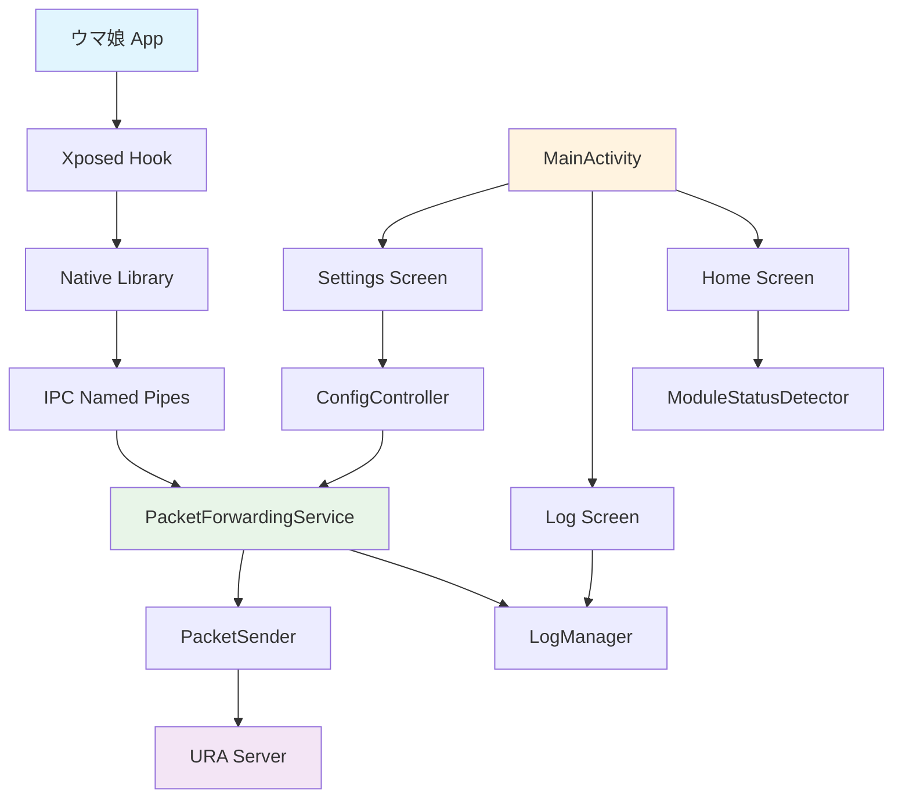

# LSPCarrotJuicer

A packet inspection module for ウマ娘 (Uma Musume) Android client, built with LSPosed framework and featuring a complete service-based architecture.

## 🏗️ Architecture Overview



## ✨ Features

### 🎯 Core Functionality
- **Packet Interception**: Hooks into ウマ娘's network layer to capture HTTP/HTTPS packets
- **Real-time Forwarding**: Sends intercepted packets to configurable URA server
- **Service-based Architecture**: Robust background service with proper lifecycle management
- **IPC Communication**: High-performance named pipe communication between native and Kotlin layers

### 🎨 Modern UI
- **Material 3 Design**: Beautiful, responsive interface following latest design guidelines
- **Smooth Animations**: Polished transitions and interactive feedback
- **Real-time Monitoring**: Live status updates and service health monitoring
- **Comprehensive Logging**: Advanced log viewer with filtering and search capabilities

### ⚙️ Configuration Management
- **Soft-kill Switch**: Enable/disable packet forwarding without restarting
- **Server Configuration**: Easy URA server URL management with connectivity testing
- **Persistent Settings**: Configuration saved across app restarts
- **Error Handling**: Comprehensive error reporting and recovery mechanisms

## 🚀 Technical Stack

- **Language**: Kotlin 2.1 + C++23
- **Framework**: Android + LSPosed + Xposed
- **UI**: Jetpack Compose with Material 3
- **Architecture**: MVVM + Service-oriented
- **Concurrency**: Kotlin Coroutines + Flow
- **IPC**: Named Pipes (FIFO)
- **Serialization**: kotlinx-serialization
- **Build System**: Gradle 8.14.2 + AGP 8.10.1

## 📱 Screenshots

### Home Screen
- Module activation status
- Service health monitoring
- Real-time packet statistics
- Error reporting with actionable insights

### Settings Screen
- Module enable/disable toggle
- URA server URL configuration
- Connectivity testing
- Configuration persistence
- About section with version info

### Log Screen
- Real-time log streaming
- Advanced filtering (level, tag, search)
- Expandable log entries
- Color-coded severity levels
- Export and clear functionality

## 🔧 Installation

### Prerequisites
- Android device with root access
- LSPosed framework installed
- Target app: ウマ娘 プリティーダービー (`jp.co.cygames.umamusume`)

### Setup Steps
1. Download and install the LSPCarrotJuicer APK
2. Enable the module in LSPosed Manager
3. Configure the target app scope to include ウマ娘
4. Restart the target application
5. Configure URA server URL in the module settings
6. Enable packet forwarding

## 🏛️ Architecture Details

### Service Layer
- **PacketForwardingService**: Foreground service handling packet processing
- **Thread-safe Operations**: Atomic state management with proper synchronization
- **Channel-based Processing**: Unlimited capacity packet queue with backpressure handling
- **Graceful Shutdown**: Proper cleanup and acknowledgment protocols

### IPC Communication
- **Named Pipes**: High-performance inter-process communication
- **Binary Protocol**: Efficient packet serialization with size headers
- **Handshake Mechanism**: Connection establishment with timeout handling
- **Heartbeat System**: Connection health monitoring

### Native Layer
- **Hook Integration**: LSPosed native hook for packet interception
- **Memory Safety**: Bounds checking and proper resource management
- **Error Resilience**: Comprehensive error handling and recovery
- **Performance Optimization**: Minimal overhead packet processing

### Data Management
- **ConfigController**: Persistent configuration with SharedPreferences
- **LogManager**: Thread-safe log collection with size limits
- **ServiceModels**: Serializable data classes for IPC communication

## 🔒 Security Considerations

- **Local Communication**: IPC pipes restricted to app's private directory
- **No Network Permissions**: Module itself doesn't require internet access
- **Secure Configuration**: Settings encrypted in SharedPreferences
- **Minimal Permissions**: Only essential Android permissions requested

## 🐛 Troubleshooting

### Common Issues
1. **Module Not Loading**: Verify LSPosed is active and module is enabled
2. **Service Not Starting**: Check configuration and URA server accessibility
3. **Packet Loss**: Monitor log screen for IPC communication errors
4. **Performance Issues**: Adjust packet processing settings in configuration

### Debug Information
- Enable verbose logging in LSPosed Manager
- Check module logs in the Log Screen
- Monitor service status in Home Screen
- Test connectivity using built-in connectivity checker

## 🛠️ Development

### Building from Source
```bash
git clone https://github.com/your-repo/LSPCarrotJuicer.git
cd LSPCarrotJuicer
./gradlew assembleDebug
```

### Project Structure
```
app/
├── src/main/
│   ├── java/top/wxx9248/lspcarrotjuicer/
│   │   ├── data/           # Data models and serialization
│   │   ├── ipc/            # Inter-process communication
│   │   ├── network/        # HTTP client and networking
│   │   ├── service/        # Background services
│   │   ├── ui/             # Compose UI components
│   │   ├── utils/          # Utility classes
│   │   └── xposed/         # Xposed module entry point
│   └── cpp/                # Native C++ code
│       ├── Hook.c          # Main hooking logic
│       ├── Notify.c        # IPC communication
│       └── *.h             # Header files
```

## 📋 Requirements

### Runtime Requirements
- Android 8.0+ (API 26+)
- LSPosed Framework
- Root access
- Target app installed

### Build Requirements
- Android Studio 2024.1+
- Gradle 8.14.2+
- Android Gradle Plugin 8.10.1+
- Kotlin 2.1.21+
- NDK 26.1.10909125+

## 📄 License

This project is licensed under the MIT License - see the [LICENSE](LICENSE) file for details.

## 🤝 Contributing

Contributions are welcome! Please read our contributing guidelines and submit pull requests for any improvements.

## ⚠️ Disclaimer

This tool is for educational and research purposes only. Users are responsible for complying with all applicable laws and terms of service. The developers are not responsible for any misuse of this software.

## 🙏 Acknowledgments

- LSPosed team for the excellent framework
- Xposed community for documentation and support
- ウマ娘 community for testing and feedback

---

**Note**: This module is designed specifically for ウマ娘 プリティーダービー and may not work with other applications without modifications.
